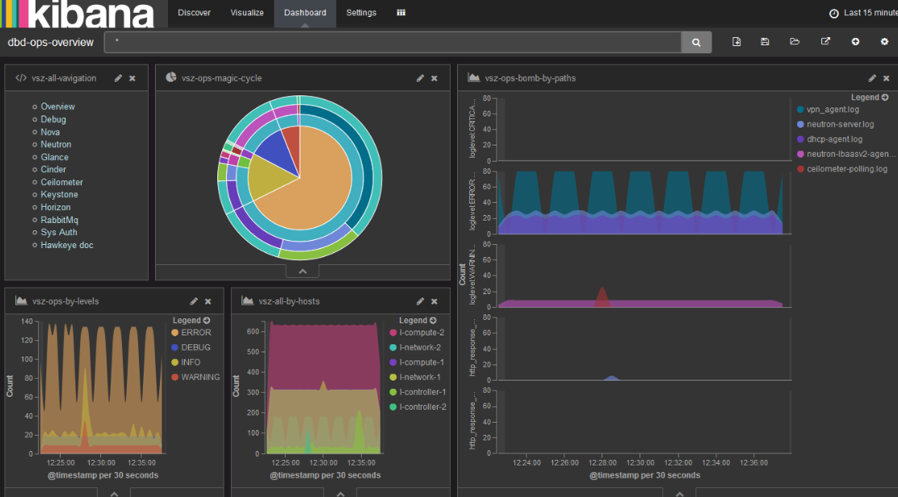

# What's hawk

hawkEye是一套依托于ELKstask对openstack日志进行可视化的系统。

**目标**

hawkeye监视的日志主要为openstack平台，核心目标：
- 对openstack日志进行可视化，通过dashboard devops可以了解系统整体状态。
- devops debug平台。devops只需要通过hawkeye即可对openstack问题进行定位，尽量不需要登录各个子系统。

**组成**

hawkeye主要通过logstash进行日志收集与解析工作，通过elastacsearch进行存储索引，通过kibana进行展示。这里将hawkeye拆分为多个子项目。

- hawkeye-logstash
   logstash shipper configs.
- hawkeye-kibana
   可视化魔板,相关的search,visualization,dashboard.
- hawkeye-ansible
   通过ansible部署hawkeye

# What's hawk-kibana

hawk-kibana是通过kibana定义相关的search,visualization,dashboard来对openstack进行可视化。
在定制过程中使用的字段等都是通过hawk-logstash进行解析的。

# search,visualization,dashaboard命名规则

**`<preffix>-[scope]-<desc>`**

每个json文件通过上面的方式进行命名，方便管理。scope可以省略。

- preffix
    - sch search
    - vsz visualization
    - dbd dashboard
- scope
    - all 对所有的私用
    - service: nova,horizon  针对特定的服务
- desc 关于该文件的描述

# 提供的search,visualization,dashboard

**searches**

定义了3个searches,主要定制了显示的field,方便查看。

- sch-all-entry 所有日志,fields: time, message, loglevel, path, host
- sch-ops-entry openstack日志,fields: time, message, loglevel, path, host
- sch-ops-bomb  openstack调试日志，需要关注的日志，否则会出大问题

**visualization**

- vsz-all-navigation 导航
- vsz-ops-magic-cycle 内到外: level -> type -> path -> host
- vsz-all-by-hosts    对所有日志根据hosts进行分组显示
- vsz-ops-by-hosts    对openstack日志根据hosts进行分组显示
- vsz-ops-by-types
- vsz-ops-by-paths
- vsz-ops-by-reqids
- vsz-ops-by-http-codes
- vsz-ops-by-http-methods
- vsz-ops-by-http-reponses
- vsz-ops-by-http-bytes
- vsz-ops-api-top10  api请求响应top10
- vsz-ops-bomb-by-paths  出错日志根绝paths进行分组
- vsz-ops-bomb-by-hosts
- vsz-ops-bomb-by-types
- vsz-ops-bomb-by-api-top10
- vsz-horizon-action-by-users 对horizon的登陆事件与用户进行可视化
- vsz-rabbitmq-action-by-sip

**dashboard**

- dbd-ops-ovewview
- dbd-ops-debug
- dbd-nova
- dbd-neutron
- dbd-glance
- dbd-cinder
- dbd-ceilometer
- dbd-keystone
- dbd-horizon
- dbd-rabbitmq
- dbd-auth

# 如何便捷导入

当前提供的defines都分别存放在json目录中，当进行kibana导入的时候如果一个一个的导入很麻烦。可以通过`tools/convert.py`将这么json文件合并成一个文件，然后进行导入即可。

合并操作

    cd tools
    python convert.py --func join -d ../json -f all.py

同时convert.py也可以进行split操作 

    cd tools
    python convert.py --func split -d tmp -f all.py
